# IntelPA cluster quick-start

## 1 Setting up SSH server
### 1.1
Passwords are disabled on the server, so you need to log in using your SSH publickey. To generate this:
```console
user@local:~$ ssh-keygen
```
### 1.2
Once your publickey is generated copy it from `/home/user/.ssh/id_rsa.pub` and send it to either Kavi(kjayathunge@bournemouth.ac.uk) or Jiajun(jhuang@bournemouth.ac.uk) so you can be added as a user on the cluster. Make sure it is the file ending in `.pub`, don't give away your private key (`id_rsa`)!

### 1.3
Once the account is created, you should be able to login: 
```console
user@local:~$ ssh user@intelpa-2.student.bournemouth.ac.uk
Welcome to Ubuntu 20.04.4 LTS (GNU/Linux 5.14.0-1051-oem x86_64)

 * Documentation:  https://help.ubuntu.com
 * Management:     https://landscape.canonical.com
 * Support:        https://ubuntu.com/advantage

2 devices have a firmware upgrade available.
Run `fwupdmgr get-upgrades` for more information.


95 updates can be applied immediately.
To see these additional updates run: apt list --upgradable

New release '22.04.1 LTS' available.
Run 'do-release-upgrade' to upgrade to it.

Last login: Thu Oct 13 13:46:20 2022 from 10.126.53.243
```
This banner message means you've successfully logged on to the server. 

### 1.4
To set up the SSH 
container that you'll be connecting to your IDE:
```console
user@intelpa-2:~$ cp -r /mnt/intelpa-1/intelpa-containers ~ 
user@intelpa-2:~$ chmod -R 700 ~/intelpa-containers
user@intelpa-2:~$ cd ~/intelpa-containers
user@intelpa-2:~$ podman build -f Dockerfile.cli-workspace -t test-cli-workspace .
user@intelpa-2:~$ ./start_cli_server.sh test
```
Note that the `intelpa-containers` directory is only available at `/mnt/intelpa-1`,
please do not change this.

### 1.5
If all goes well, you should see something like this:
```console
Checking for free network ports in range 1024 to 49151...
This may take a while in (very) rare cases.
Found free port, copy this and use it to configure your IDE's SSH interpreter: 1025
```
Keep a note of the port number, you'll need it for the next step.


<!-- ### 1.6
*NOTE:* Annoyingly, by default the system seems to kill the Podman process if the shell
session it was started in dies (for e.g. if you logout of intelpa-2). To prevent
this behaviour:
```console
user@intelpa-2:~$ loginctl enable-linger
```

*NOTE:* Podman by default generates (sometimes very large) container storage files and saves them
in the root partition of the machine. This frequently leads to storage issues
and can slow down the machines. Please follow these steps to change the default
directory for storing these files to the much larger dedicated data storage
disks:
```console
user@intelpa-2:~$ cp /mnt/intelpa-2/setup_podman_storage.sh ~
user@intelpa-2:~$ chmod +x ~/setup_podman_storage.sh
user@intelpa-2:~$ ./setup_podman_storage.sh
``` -->
## 2 Connecting your editor to the server
### 2.1 Instructions for VScode
Launch VScode on your local machine and follow these instructions:

2.1.1. Locate the remote window button in the bottom left corner of the screen and click it:   

   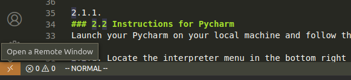

2.1.2. This will open a pop-up window asking you to select from a list of previously added SSH hosts. Select `+ Add New SHH Host` from this list, and enter the hostname (including user) of the server you wish to connect to. In this example, we use `root@intelpa-2.student.bournemouth.ac.uk`. We also need to provide the port that our container is listening on, which we got from the previous script.   

   <p float="left">
      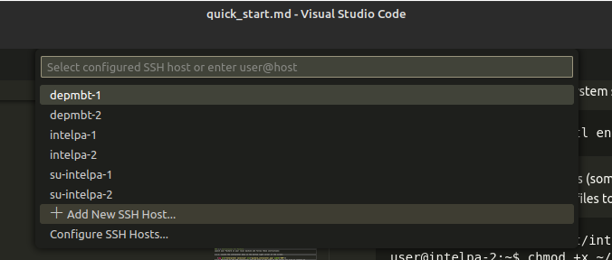
      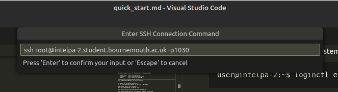
   </p>

2.1.3. You will then need to provide VSCode with your local SSH configuration, which is usually located in a hidden `.ssh` folder in your home directory. If all goes well, you should see a success popup in the bottom right of the screen.

   <p float="left">
      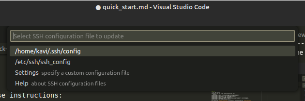
      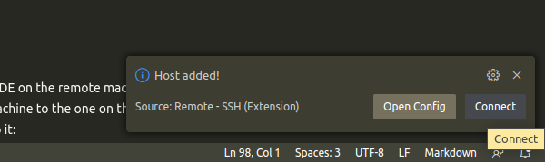
   </p>

2.1.4. You should now be able to see the newly added host in the list of SSH hosts from the previous step. Click on it and wait for a new window to open up. This window will ask you to confirm adding the host's public keys to your local list of allowed hosts. Hit continue in this menu to allow the connection.


   <p float="left">
      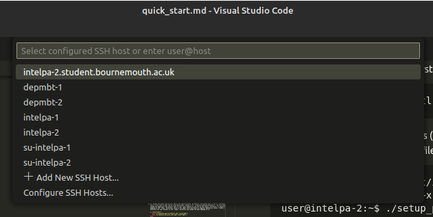 
      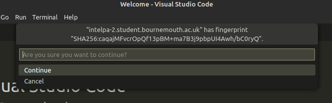
   </p>

2.1.5. There's a good chance that you will be using Python in your machine learning application, so it's recommended that you install the Python extension for VSCode to facilitate development and manage Python environments. Click on the extensions icon on the left side of the VSCode window and install the Python extension.

   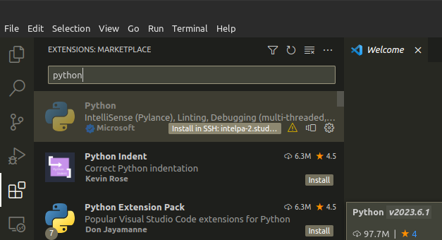

2.1.6. Once the extension is installed, you can set the default Python interpreter for your project. Hit `Ctrl + Shift + P` to bring up the settings menu and start typing `interpreter` to bring up the Python interpreter settings. From there select the one that you wish to use. This is where you might want to switch your Python executable from the default system one to whatever virtual evironments you may have specified in your `Dockerfile`.

   <p float="left">
      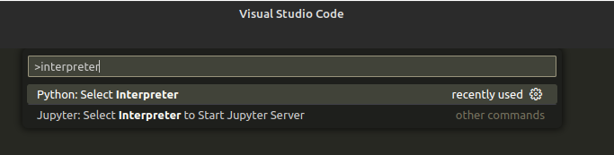
      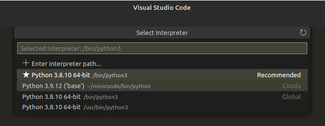
   </p>

2.1.7. Hit ``Ctrl + ` `` to open the terminal - you should now be logged in to the container via VSCode's terminal  

   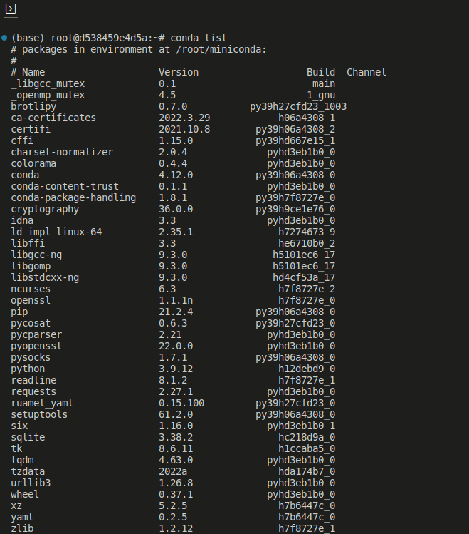

2.1.1.
### 2.2 Instructions for Pycharm
Launch your Pycharm on your local machine and follow these instructions: 

2.2.1. Locate the interpreter menu in the bottom right corner of the screen:   

   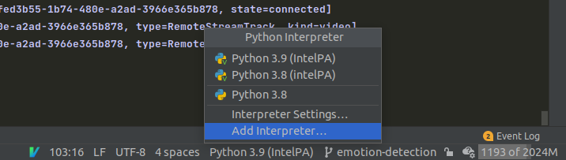

2.2.2. Navigate to the SSH interpreter tab and type in the name of the server you wish to connect to. 
   In this example, we use `intelpa-2.student.bournemouth.ac.uk`. Paste in the port number from the 
   previous script and set the Username as `root`.   

   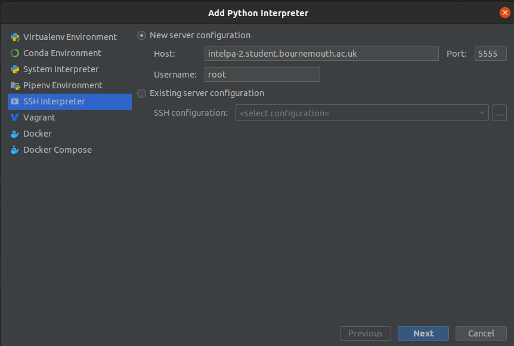

2.2.3. Change the paths used by your IDE on the remote machine. By default, the python path is set to `/bin/python`,
   which is not what we want (We're using Miniconda). Change it to `/root/miniconda/bin/python3.9`. We also need to 
   change the mapping of the project root on your local machine to the one on the remote. Currently, it should be
   mapping to the `/tmp/` directory, which is not ideal (this directory is regulary emptied by Linux). Create a 
   directory for your project in the `/home/` directory and change the path mapping to it:  

   <p float="left">
      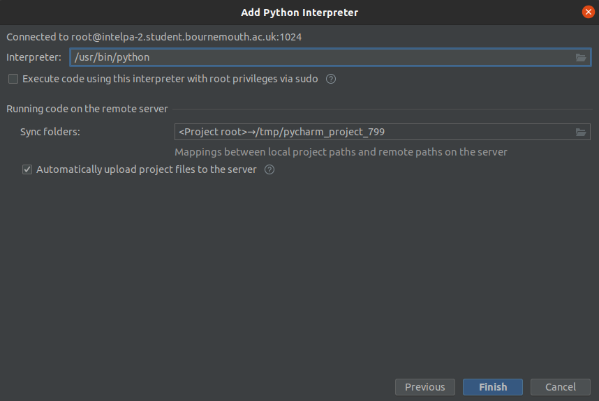 
      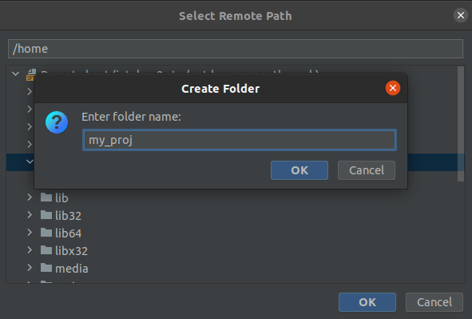
   </p>

2.2.4. Please make sure your settings look like this before hitting finish.  

   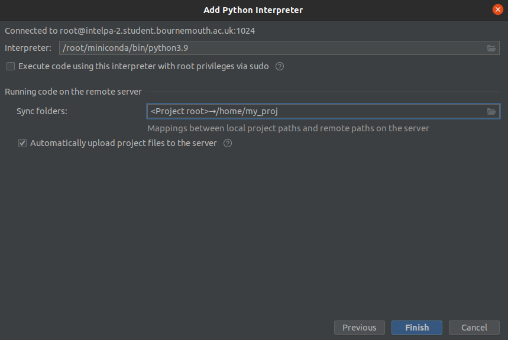

2.2.5. If all goes well, you should see the following message in the bottom left of your screen informing you that 
   your files were successfully transferred:   

   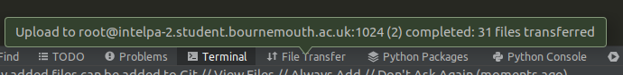

2.2.6. Hit `Ctrl + Shift + A` to open the Actions menu and select `Start SSH Session`.   

   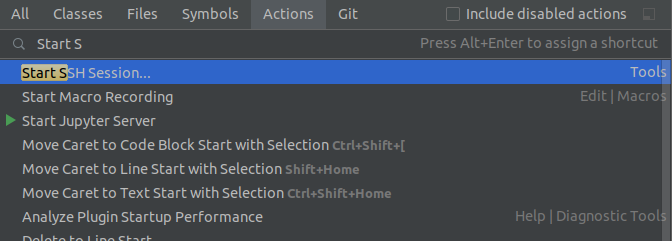

2.2.7. From the prompt that pops up, select the host (begins with `root@` and ends with the port number you copied in)  

   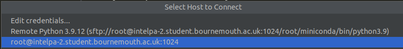

2.2.8. You should now be logged in to the container via Pycharm's terminal.

   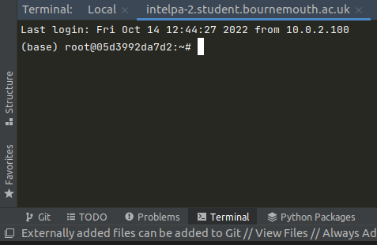
