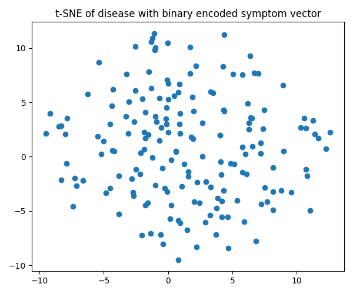

# Progress Report - Jiajun Huang

## What I have done

### implementation of AD-NeRF

* the project group have finally released their code([Github](https://github.com/YudongGuo/AD-NeRF)), tried setting up the model and start training
    * read their model training code, found many similar places between theirs and mine
    * just realized we might not have enough resource to train this model......

### Intel-PA

* integrated the Watson ACD NER API into the analysis pipeline

* used the analysis pipeline to extract symptoms for diseases

* built decision tree using the traditional algorithm and another hand-written one to ensure no misclassification (see attachment 1 & 2)

* built the t-SNE plot of the encoded vectors for distribution analysis

## What I intend to do next

* deal with probationary review viva

* make a tough decision, either optimize the NeRF model in AD-NeRF or abandon the model entirely and go for another model