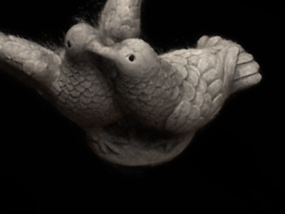

# Progress Report - Jiajun Huang

## What I have done

finished major review, heading back to research

### Personal Research

completed pilot study on faster NeRF idea, currently working on quality improvements to reach publication.

volume rendering result(~1min)

sphere trace result(~1s)

### Intel-PA

* finished refactoring and simplifying code for further development

## What I intend to do next

* continue develop my current idea
* start working on client->server audio/video streaming infrastructure