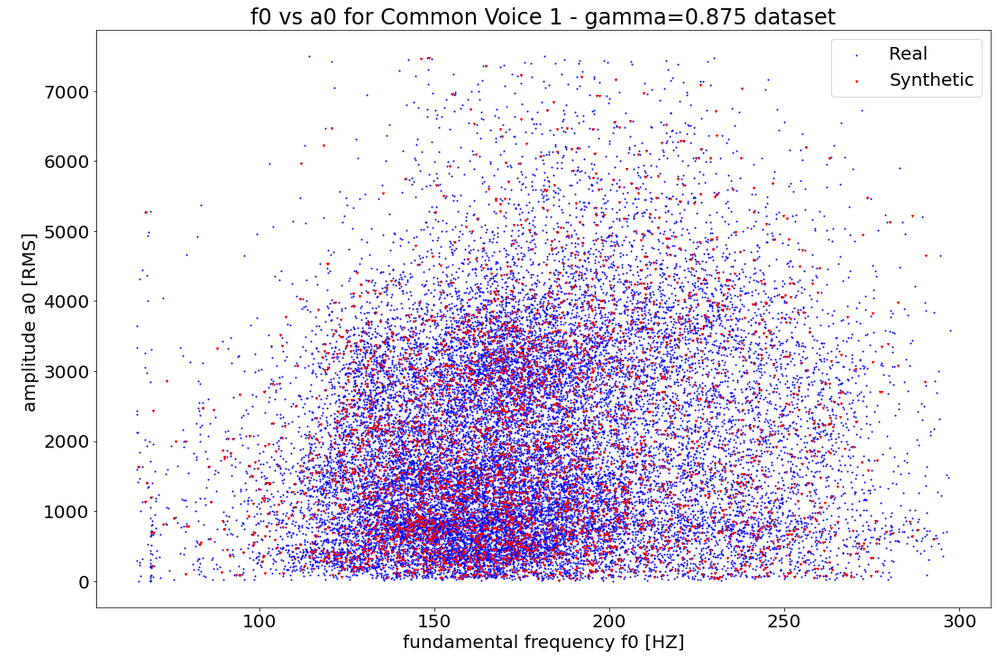
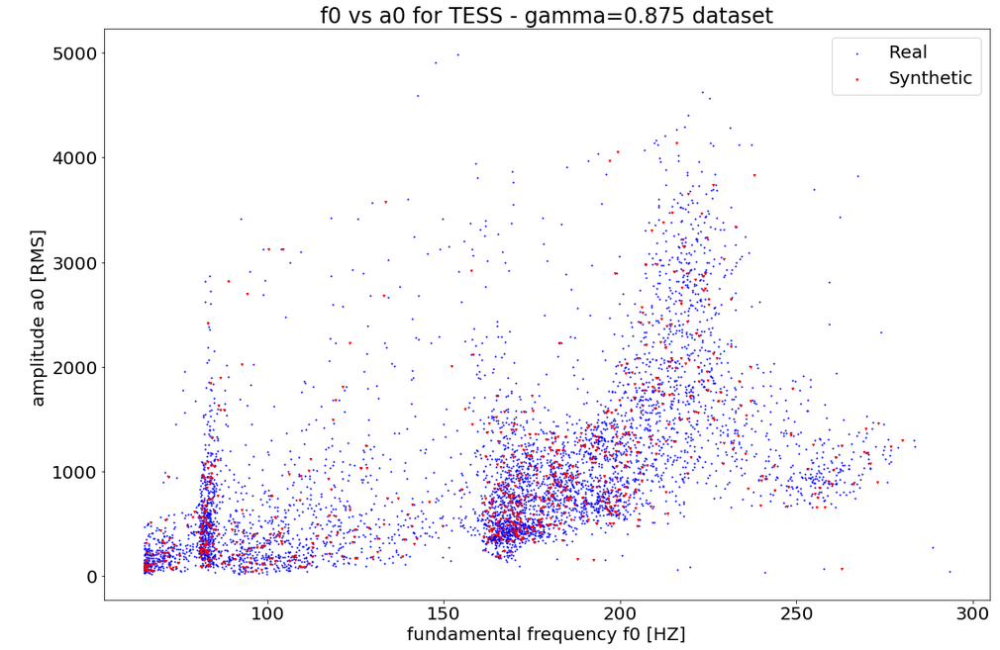
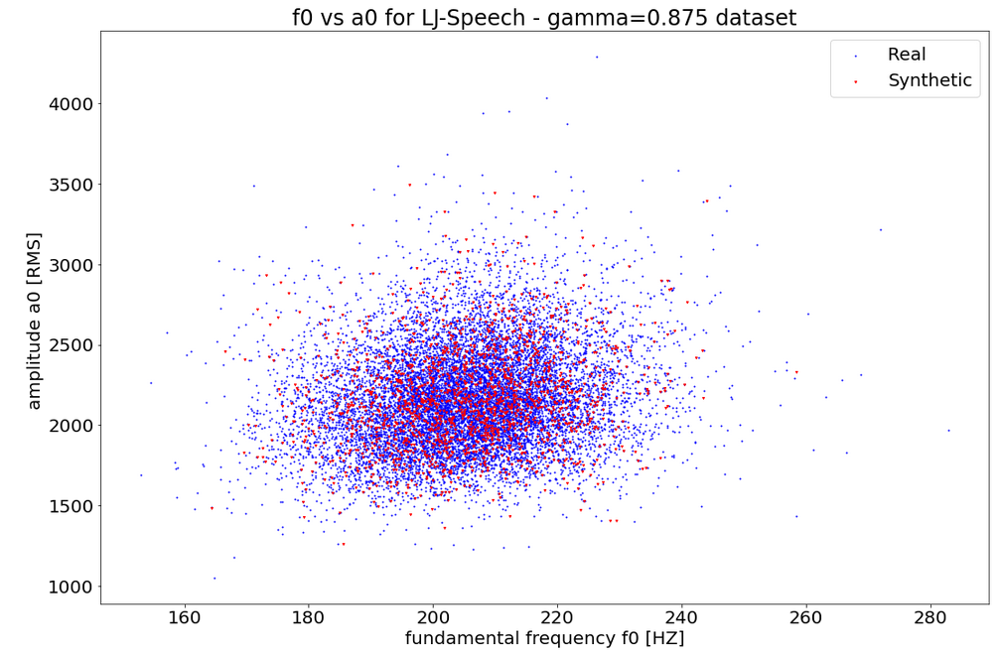

# Progress report - 05/04/2022 - Kavi

## What I've done

* Helped Jiajun with the integration of his 3D talking head into our existing IntelPA pipeline
* Collected 3 different deep learning speech applications along with 3 datasets to test audio augmentation strategies on 
* Implemented and visualised a proposed data augmentation strategy
	* 
	* 
	* 
* Started writing major review 

## What I'll do next

* Complete major review
* Start audio augmentation experiments